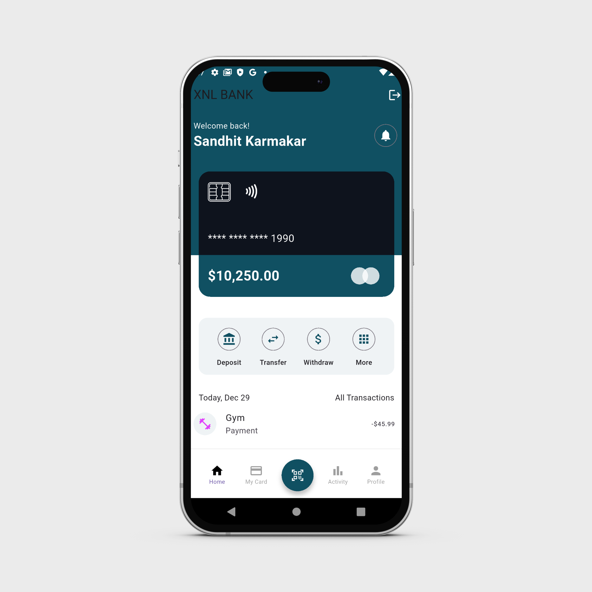

<h1 align="center"><b>✨ SWIFTPAY - Fintech Platform ✨</b></h1>


## 📌 Project Overview
Swiftpay is a **highly scalable**, **event-driven**, **microservices-based banking application** that provides secure and **efficient financial transactions**, user authentication, notifications, and risk management.Built with Node.js, Express.js, MongoDB, Kafka, Firebase,Flutter, Kubernetes, and Terraform. This project ensures security, scalability, and high availability.

## 🌟 Key Features

- ✅ Microservices Architecture → Independent services for Transactions, Users, Notifications, Financial Products, Risk Management, and Audit Logging.
- ✅ JWT & Firebase Authentication → Secure login and session management.
- ✅ Real-Time Transactions → Handle deposits, withdrawals, and transfers with MongoDB.
- ✅ Event-Driven Communication → Uses Kafka for asynchronous messaging.
- ✅ Push Notifications → Firebase Cloud Messaging (FCM) for real-time alerts.
- ✅ Fraud & Risk Analysis → AI-powered risk evaluation.
- ✅ Scalable Infrastructure → Deployable with Kubernetes and Terraform on AWS/GCP.
- ✅ CI/CD Integration → Automated deployments with GitHub Actions & GitLab CI/CD.
- ✅ Fully Documented API → Swagger documentation for seamless integration.
- ✅ React.js Frontend → Interactive banking dashboard.

## ⚙️ Tech Stack Used

### **Backend Technologies**
- **Node.js** → JavaScript runtime for backend development.
- **Express.js** → Lightweight and fast web framework for Node.js.
- **MongoDB** → NoSQL database for handling transactions & user data.
- **Kafka** → Event-driven messaging for microservices communication.
- **Firebase Authentication** → Secure user login with JWT.
- **Firebase Cloud Messaging (FCM)** → Push notifications for transactions.
- **RabbitMQ** → Optional message queue for async processing.
- **Docker** → Containerized application for scalability.
- **Kubernetes** → Orchestrating and deploying microservices.

### **Frontend Technologies**
- **React.js** → User-friendly and scalable banking dashboard.
- **Redux** → State management for efficient UI updates.
- **Axios** → API calls to backend services.

### **DevOps & CI/CD**
- **GitHub Actions** → Automating builds, testing, and deployments.
- **GitLab CI/CD** → Continuous integration & delivery.
- **Terraform** → Infrastructure as code for AWS/GCP deployments.
- **Helm** → Managing Kubernetes applications.

### **Security & Compliance**
- **JWT (JSON Web Tokens)** → Secure authentication & API access.
- **TLS Encryption** → Protecting data in transit.
- **OAuth 2.0** → Secure third-party login integrations.
- **PCI DSS Compliance** → Secure handling of payment data.


## 📂 Project Structure

```shell
/XNL-21BAI1743-MOBILE-1
│
├── /microservices              # Microservices directory
│   ├── /transaction-service    # Handles transactions
│   ├── /user-service           # Manages user data and authentication
│   ├── /notification-service   # Handles sending notifications
│   ├── /financial-product-service # Manages financial product data
│   ├── /risk-management-service # Handles risk analysis and alerts
│   └── /audit-service          # Audit logging and data integrity
│
├── /frontend                   # Frontend application (React.js)
│   ├── /src                    # Source files for the UI
│   ├── /public                 # Static assets
│   └── /build                  # Compiled frontend
│
├── /infrastructure             # Infrastructure as code
│   ├── /kubernetes             # Kubernetes deployment configurations
│   ├── /terraform              # Terraform scripts for cloud provisioning
│   └── /helm                   # Helm charts for Kubernetes deployment
│
├── /ci-cd                      # CI/CD pipeline configurations
│   ├── /github-actions         # GitHub Actions workflows
│   └── /gitlab-ci              # GitLab CI/CD configurations
│
└── /docs                       # Documentation
    ├── /api                    # Swagger API documentation
    └── /user                   # User documentation
```

## 🛠️ Microservices Overview  

Each microservice runs independently and is responsible for a specific domain.  

### 1️⃣ API Gateway (Port: 3000)  
   - Routes requests to microservices.  
   - Handles authentication and load balancing.  

### 2️⃣ User Service (Port: 4001)  
   - User authentication via Firebase and JWT.  
   - Manages user profiles and balances.  

### 3️⃣ Transaction Service (Port: 4002)  
   - Handles deposits, withdrawals, and transfers.  
   - Maintains transaction history in MongoDB.  

### 4️⃣ Notification Service (Port: 4003)  
   - Sends push notifications using Firebase Cloud Messaging.  
   - Email and SMS alerts for account activity.  

### 5️⃣ Financial Product Service (Port: 4004)  
   - Manages banking products such as loans, savings, and credit cards.  
   - Provides interest rate calculations.  

### 6️⃣ Risk Management Service (Port: 4005)  
   - AI-driven fraud detection and analysis.  
   - Flags suspicious transactions.  

### 7️⃣ Audit Service (Port: 4006)  
   - Logs user activities for security auditing.  
   - Ensures compliance with financial regulations.  

## 📦 Deployment & Setup
### 1️⃣ Clone the repository
```shell
git clone https://github.com/Sandhit06/XNL-21BAI1743-MOBILE-1.git
cd XNL-21BAI1743-MOBILE-1
```
### 2️⃣ Install dependencies
```shell
cd microservices/user-service
npm install
```
### 3️⃣ Start services
```shell
docker-compose up -d
```

### 4️⃣ Access API Gateway
```shell
http://localhost:3000/
```

## 🏗️ Infrastructure as Code
### Kubernetes Deployment

```yaml
apiVersion: apps/v1
kind: Deployment
metadata:
  name: transaction-service
spec:
  replicas: 2
  selector:
    matchLabels:
      app: transaction-service
  template:
    metadata:
      labels:
        app: transaction-service
    spec:
      containers:
      - name: transaction-service
        image: transaction-service:latest
        ports:
        - containerPort: 4002
```
### 🔄 CI/CD Pipeline
GitHub Actions Workflow (.github/workflows/deploy.yml)
```yaml
name: Deploy Banking App
on:
  push:
    branches:
      - main
jobs:
  build:
    runs-on: ubuntu-latest
    steps:
      - name: Checkout Code
        uses: actions/checkout@v3
      - name: Build Docker Images
        run: docker-compose build
      - name: Deploy to Kubernetes
        run: kubectl apply -f infrastructure/kubernetes/
```

## 📄 Documentation
### Swagger API Documentation
```shell
{
  "swagger": "2.0",
  "info": {
    "title": "Banking API",
    "version": "1.0.0"
  },
  "paths": {
    "/transactions/transfer": {
      "post": {
        "summary": "Transfer Money",
        "responses": {
          "200": { "description": "Success" }
        }
      }
    }
  }
}
```
## **📸 Screenshot**
<p align="center">
    
</p>

## Troubleshooting
No detections in the video
Ensure your model file is correctly loaded and the video file path is correct. Check if the video has clear visibility and minimal occlusions.

## ⚠ Disclaimer
This tool is developed for educational and developmental purposes. It's crucial to understand the implications and responsibilities of using such technologies in real-world applications.


## Still need help?
Open an issue on our GitHub repository, and we will help you as soon as possible.

Enjoy exploring and extending this project! Feel free to contribute and suggest improvements.

## Contact

If you want to contact me you can reach me at [Twitter](https://x.com/SandhitK).

## Developer
<table>
    <tr align="center">
        <td>
        Sandhit Karmakar
        <p align="center">
            
        </p>
            <p align="center">
                <a href = "https://github.com/Sandhit06">
                    
                </a>
                <a href = "https://www.linkedin.com/in/sandhit-karmakar/" target="_blank">
                    
                </a>
                <a href = "mailto:sandhitkarmakar@gmail.com" target="_blank">
                    
                </a>
            </p>
        </td>
    </tr>
</table>

<p align="center">
    Made with ❤️ by <a href="https://github.com/Sandhit06">Sandhit Karmakar</a>
</p>
